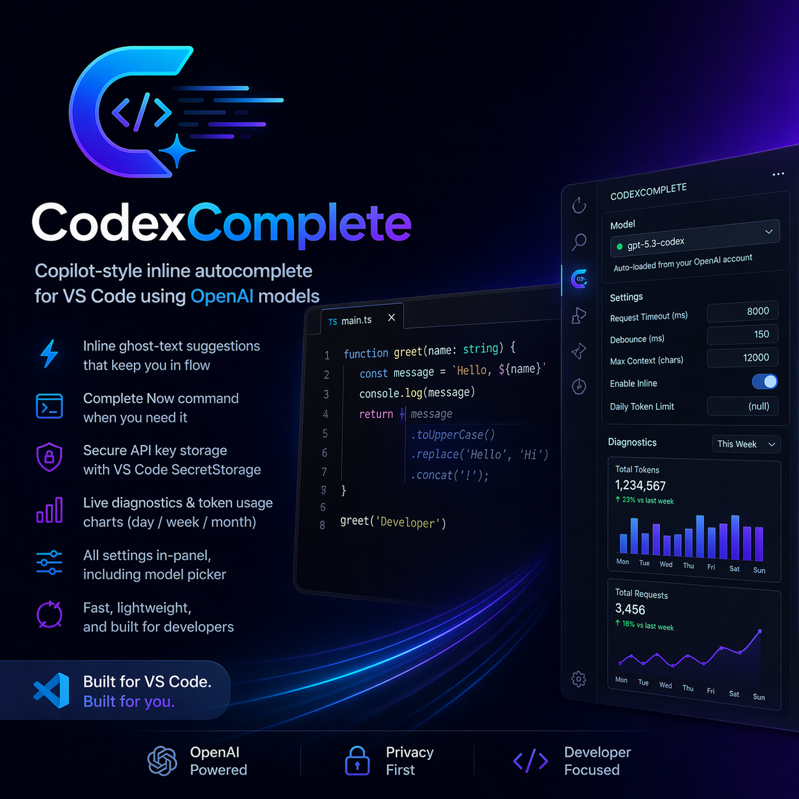

# CodexComplete

CodexComplete is a VS Code autocomplete extension that delivers Copilot-style inline suggestions using OpenAI API models (default: `gpt-5.3-codex`).



## Features (POC)

- Inline ghost-text autocomplete while typing.
- Manual command to complete at the current cursor.
- Fast defaults for low-latency coding flow.
- API key stored securely in VS Code `SecretStorage`.
- Activity Bar icon with a full CodexComplete GUI sidebar.
- In-panel settings editor (model, timeout, debounce, context, inline toggle, strict inline controls).
- Built-in safety: completion is automatically disabled for files/paths containing `env`.
- Custom ignored-path regex list in settings/UI for additional exclusion rules.
- Model dropdown auto-loads all models available to the user's OpenAI API key.
- Live diagnostics + token usage charts grouped by day/week/month.
- Optional daily token limit (null = no limit).

## Setup

1. Install dependencies:
   ```bash
   npm install
   ```
2. Build:
   ```bash
   npm run compile
   ```
3. Launch Extension Development Host from VS Code (`Run Extension`).
4. Run command: `CodexComplete: Set OpenAI API Key`.
5. Open the **CodexComplete** icon in the Activity Bar to use the GUI.

## Commands

- `CodexComplete: Set OpenAI API Key`
- `CodexComplete: Complete Now`
- `CodexComplete: Open Diagnostics Panel`

## Settings

- `codexComplete.model`
- `codexComplete.requestTimeoutMs`
- `codexComplete.debounceMs`
- `codexComplete.maxContextChars`
- `codexComplete.enableInline`
- `codexComplete.includeLeadingLogicComment`
- `codexComplete.indentMode`
- `codexComplete.inlineMaxLines`
- `codexComplete.inlineMaxChars`
- `codexComplete.strictInlineMode`
- `codexComplete.dailyTokenLimit`
- `codexComplete.ignorePathRegexes`

## Notes

- API key is never stored in plaintext settings.

## Data Retention & Privacy

- CodexComplete stores usage metrics locally on your machine using VS Code extension storage.
- By default, there is no external database and no remote analytics telemetry from CodexComplete.
- Diagnostic views (like token usage charts) read from local data only.
- Data stays in your local VS Code profile and follows normal profile/extension lifecycle unless you clear extension data or uninstall.
- We recommend treating local extension data as sensitive developer metadata and protecting your workstation/profile backups accordingly.

## Open Source

- License: [MIT](./LICENSE)
- Contributing guide: [CONTRIBUTING.md](./CONTRIBUTING.md)
- Community guidelines: [CODE_OF_CONDUCT.md](./CODE_OF_CONDUCT.md)
